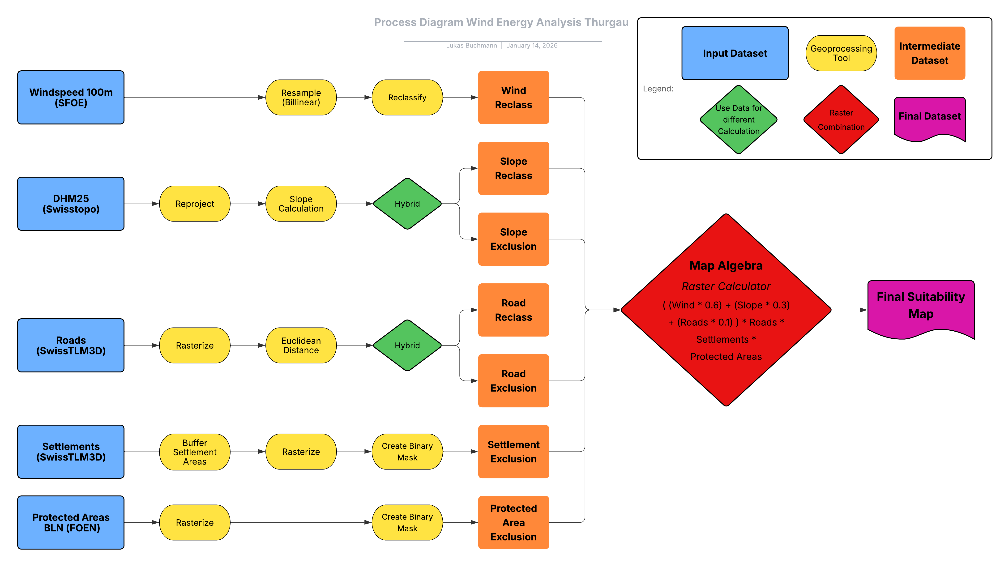
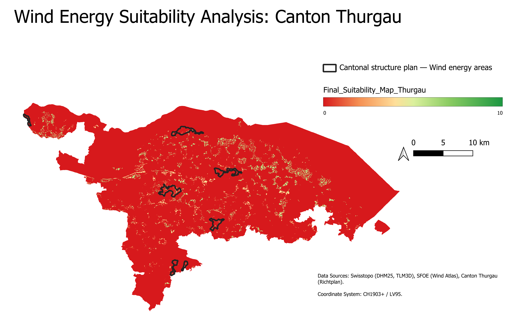

# Site Suitability Analysis for Wind Energy in Canton Thurgau

## Project Overview
This project identifies suitable locations for wind turbine development in Canton Thurgau (Switzerland) by balancing economic, legal, and social requirements. The analysis was conducted as part of the GISScience and Geodatabases module at the Zurich University of Applied Sciences (ZHAW). 

Due to complex topography, high population density, and landscape protection laws, finding suitable sites for wind energy on the Swiss Plateau is highly challenging. This project tackles this issue by utilizing a **Geographic Information System (GIS)-based Multi-Criteria Analysis (MCA)** within QGIS.

---

## Methodology

The analysis employs a **Hybrid MCA Approach**, which distinguishes between strict Binary Constraints (Exclusion Zones scored 0 or 1) and Weighted Suitability Factors (scored 1-10).

### 1. Exclusion Criteria (Constraints)
Areas legally or technically unsuitable were assigned a value of 0:
* **Settlements:** Conservative 300m noise protection buffer.
* **Protected Areas:** Federal Inventory of Landscapes and Natural Monuments (BLN).
* **Topography:** Slopes > 20% (technically unfeasible for cranes/construction).
* **Infrastructure:** 50m safety buffer around roads (Baulinienabstand).

### 2. Weighted Suitability Factors
The remaining areas were scored from 1 (Low) to 10 (High):
* **Wind Speed (60% Weight):** Derived from the [Swiss Wind Atlas](https://www.geocat.ch/geonetwork/srv/ger/catalog.search#/metadata/216fd29a-b016-457f-aecf-3a8b1cc70803) at 100m height.
* **Slope Suitability (30% Weight):** Flatter terrain ($0-5^{\circ}$) received the highest scores to minimize civil engineering costs.
* **Road Proximity (10% Weight):** Areas within 50-500m of existing roads scored highest to minimize access construction costs.

### Map Algebra Model
The final suitability map was generated using the following raster calculation:

`Final Score = (0.6 * Wind + 0.3 * Slope + 0.1 * Roads) * Constraints`

---

## Key Results

* **Suitable Area:** A total of 2,231 hectares ($22.3~km^{2}$) were identified as suitable for development (Score ≥ 4.4), representing approximately 2.3% of the canton's total surface area.
* **Maximum Potential:** The maximum score observed was 7.0 (out of 10). No sites achieved an "Excellent" suitability (Score > 8).
* **Conclusion:** The model confirms that Thurgau is a "low-wind" region. Economic viability will heavily depend on maximizing infrastructure access and utilizing modern "weak-wind" turbines. The model successfully identified specific, technically feasible positions that align with the official Wind Energy Areas designated in the Cantonal Structure Plan of the Canton of Thurgau.

---

## Data Sources & Reproducibility

To ensure high spatial accuracy, official open geodata from Swiss federal authorities were used. All datasets were processed in the Swiss coordinate system CH1903+/LV95 (EPSG: 2056). 

**Note on Data Storage:** To maintain a lightweight repository and adhere to best practices, the raw spatial datasets (Raster and Vector files) are *not* included in this GitHub repository. The analysis can be fully reproduced by acquiring the following public datasets:

| Dataset | Source | Description |
|---------|--------|-------------|
| [**Wind Atlas of Switzerland** (100m)](https://www.geocat.ch/geonetwork/srv/ger/catalog.search#/metadata/216fd29a-b016-457f-aecf-3a8b1cc70803) | Swiss Federal Office of Energy (BFE) | Mean annual wind speed |
| [**DHM25** (Digital Elevation Model)](https://www.swisstopo.admin.ch/de/hoehenmodell-dhm25#DHM25---Download) | Swisstopo | Elevation & Slope derivation |
| [**swissTLM3D**](https://www.swisstopo.admin.ch/de/landschaftsmodell-swisstlm3d) | Swisstopo | Roads and Settlements vectors |
| [**BLN Inventory**](https://www.geocat.ch/geonetwork/srv/ger/catalog.search#/metadata/bc3f1564-1e56-44e9-98b6-f0d8c5130410) | Federal Office for the Environment (FOEN) | Protected Areas (Strict exclusion) |

**Note on the QGIS Project File (`.qgz`):** The `.qgz` file is included in this repository to demonstrate the project structure, layer organization, and symbology. However, because the model relies on heavily processed intermediate layers generated locally (such as rasters resampled to 25m resolution and calculated Euclidean distance surfaces), the QGIS project cannot be executed out-of-the-box just by downloading the raw data.

The complete workflow, including all data preprocessing steps and the Map Algebra formulas used to create these intermediate layers, is transparently documented in the full project report.

**Full Project Report:** For a detailed breakdown of the methodology, statistical analysis, and discussion of limitations, please refer to the complete [Project Report PDF](docs/Buchmann_Lukas_Project_Report_GISScience_GDB.pdf) included in the `docs/` folder.

---

## Disclaimer
* **Data:** All spatial data referenced in this project belongs to their respective owners (Swiss Federal Office of Energy, Swisstopo, FOEN). Please adhere to the terms of use provided by the Swiss federal authorities when downloading and using their data.
